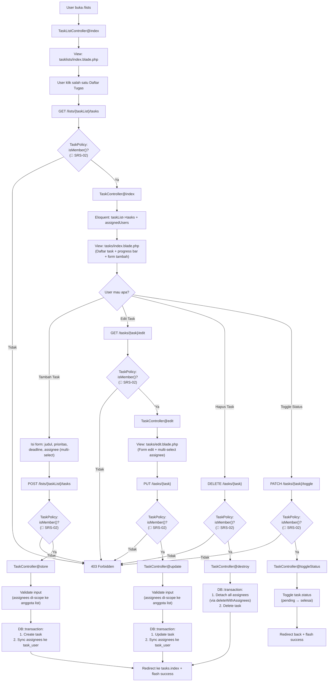
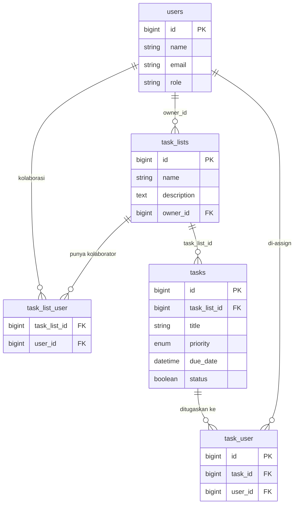
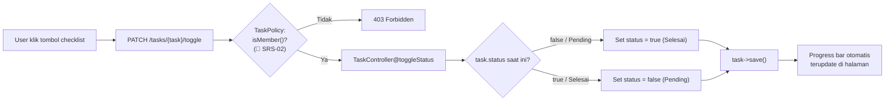
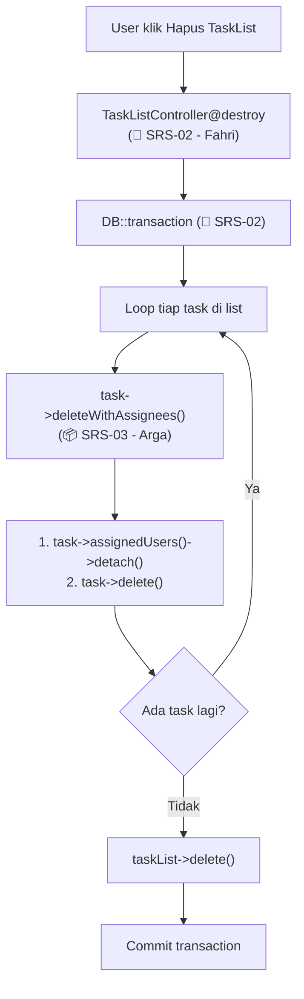
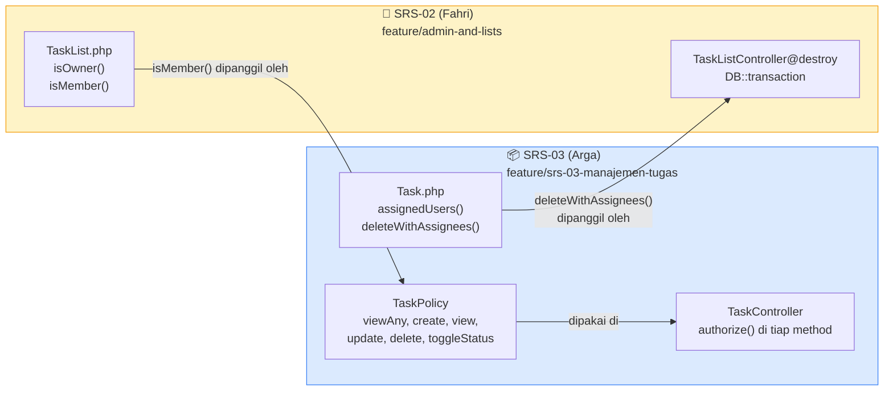

# PRD & Implementation Plan v3 — SRS-03: Manajemen Tugas, Penugasan & Tenggat Waktu

> **Branch:** `feature/srs-03-manajemen-tugas`
> **Assignee:** Arga Yura Danendra
> **Tanggal:** 16 September 2026
> **Revisi:** v3 — Tambah dependency lintas-SRS dengan SRS-02 (Fahri)

---

## 1. PRD (Product Requirements Document)

### 1.1 Ringkasan Fitur

Fitur SRS-03 menambahkan kemampuan **penugasan (assignment) banyak-ke-banyak (many-to-many)** dan **otorisasi akses berbasis keanggotaan** pada modul Task yang sudah ada di aplikasi Jara.

Saat ini, sebuah task sudah bisa di-CRUD di dalam sebuah Daftar Tugas (`TaskList`), namun:
- **Belum ada mekanisme assign** — siapa yang bertanggung jawab atas task tertentu tidak tercatat.
- **Belum ada otorisasi** — siapapun bisa mengakses task list manapun hanya dengan mengetik URL-nya.

Setelah SRS-03 selesai, user akan bisa:
1. **Meng-assign satu task ke satu atau lebih kolaborator** yang sudah terdaftar di Daftar Tugas tersebut (multi-assignee).
2. **Melihat siapa yang ditugaskan** pada tiap task di halaman daftar tugas.
3. **Mengedit assignee** kapan saja lewat halaman edit task.
4. **Dijamin aman**: hanya owner dan kolaborator terdaftar yang bisa berinteraksi dengan task di list tersebut. User lain mendapat **403 Forbidden**.

### 1.2 Flow Sistem

#### A. Flow Utama — CRUD Task + Assignee

> [!NOTE]
> Setiap request ke TaskController **selalu melewati pengecekan otorisasi (TaskPolicy)** sebelum masuk ke logic utama. Jika user bukan anggota list → langsung 403 Forbidden, flow berhenti.
> Policy memanggil `TaskList::isMember()` yang merupakan **dependency dari SRS-02 (Fahri)**.



#### B. Flow Data — Relasi Antar Tabel



#### C. Flow Toggle Status (Detail)



#### D. Flow Lintas-SRS — Hapus TaskList (🔗 SRS-02 memanggil SRS-03)

> [!NOTE]
> Flow ini **dieksekusi oleh controller SRS-02 milik Fahri**, bukan oleh TaskController SRS-03.
> Dicantumkan di sini untuk menunjukkan bagaimana method `deleteWithAssignees()` dari SRS-03 dipanggil.



### 1.3 User Flow (Langkah Bernomor)

```
1.  User membuka halaman Daftar Proyek (/lists).
2.  User mengklik salah satu Daftar Tugas.
3.  [OTORISASI] Sistem mengecek via TaskPolicy → memanggil isMember() (🔗 SRS-02):
    apakah user ini owner ATAU kolaborator list?
    → Tidak → 403 Forbidden, flow berhenti.
    → Ya → lanjut.
4.  User melihat halaman daftar task (/lists/{taskList}/tasks) + progress bar.
5.  User mengisi form "Tambah Tugas Baru":
    - Judul (wajib)
    - Prioritas: Low / Mid / High (wajib)
    - Tenggat waktu (opsional)
    - Assignee: multi-select dari daftar anggota list (opsional)
6.  User klik "Simpan Tugas" → [OTORISASI 🔗 SRS-02] → validasi (assignee harus anggota list)
    → simpan task + sync assignee (transaction).
7.  Task baru muncul di daftar dengan badge assignee.
8.  User bisa klik "Edit" → [OTORISASI 🔗 SRS-02] → ubah judul, prioritas, deadline, assignee
    → "Simpan" → [OTORISASI 🔗 SRS-02] → validasi → update (transaction).
9.  User bisa klik tombol checklist → [OTORISASI 🔗 SRS-02] → toggle Pending ↔ Selesai.
10. User bisa klik "Hapus" → konfirmasi → [OTORISASI 🔗 SRS-02]
    → task + semua assignment dihapus via deleteWithAssignees() (transaction).
```

---

## 2. Dependency & Koordinasi Lintas-SRS (SRS-02)

> [!IMPORTANT]
> SRS-03 dan SRS-02 saling bergantung. Section ini mendokumentasikan **titik-titik ketergantungan** agar kedua developer (Arga & Fahri) dan PM (Adam) punya visibilitas yang sama.

### 2.1 Method yang DIBUTUHKAN dari SRS-02 (Asumsi Eksternal)

SRS-03 **bergantung pada** method-method berikut yang akan dibuat oleh Fahri di branch `feature/admin-and-lists`. Jika method ini berubah signature atau behavior-nya, TaskPolicy SRS-03 akan break.

| Method | File | Signature yang Diasumsikan | Dipakai oleh SRS-03 di |
|---|---|---|---|
| `isOwner($userId)` | `TaskList.php` | `public function isOwner($userId): bool` — return `true` jika `$this->owner_id === $userId` | Tidak dipakai langsung oleh SRS-03, tapi menjadi bagian internal dari `isMember()` |
| `isMember($userId)` | `TaskList.php` | `public function isMember($userId): bool` — return `true` jika user adalah owner ATAU ada di `task_list_user` | **TaskPolicy** (semua method), **TaskController** (allMembers scope) |

> [!CAUTION]
> **`isMember()` adalah single point of dependency paling kritis.** Jika Fahri mengubah nama method, parameter, atau logic-nya tanpa koordinasi, seluruh otorisasi SRS-03 akan rusak.

#### Strategi Sementara (Stub untuk Testing Lokal)

Karena `isMember()` dan `isOwner()` belum ada di branch kita, **tambahkan stub method sementara** di `TaskList.php` agar TaskPolicy bisa di-test secara lokal:

```php
// ============================================================
// 🔧 STUB SEMENTARA — akan dihapus setelah branch SRS-02 di-merge
// Method asli dibuat oleh Fahri di feature/admin-and-lists
// ============================================================

public function isOwner($userId): bool
{
    return $this->owner_id === $userId;
}

public function isMember($userId): bool
{
    return $this->isOwner($userId)
        || $this->collaborators()->where('users.id', $userId)->exists();
}
```

> [!WARNING]
> Stub ini **HARUS dihapus** saat merge setelah branch Fahri sudah masuk ke `main`, karena Fahri akan punya versi definitif dari method yang sama. Jika tidak dihapus, akan terjadi **merge conflict** (yang sebenarnya diinginkan — supaya dipaksa pilih versi Fahri).

### 2.2 Method yang DISEDIAKAN SRS-03 untuk SRS-02 (Kontrak)

SRS-03 **menyediakan** method berikut yang akan dipanggil oleh Fahri dari dalam `DB::transaction` milik SRS-02 saat menghapus TaskList.

| Method | File | Signature (KONTRAK — jangan ubah) | Dipanggil oleh SRS-02 di |
|---|---|---|---|
| `deleteWithAssignees()` | `Task.php` | `public function deleteWithAssignees(): void` | `TaskListController@destroy` (SRS-02), di dalam loop tiap task saat hapus TaskList |

**Implementasi:**

```php
/**
 * Hapus task beserta seluruh assignee-nya secara atomik.
 *
 * 📦 KONTRAK SRS-03 → SRS-02
 * Method ini dipanggil oleh Fahri (SRS-02) di dalam DB::transaction
 * saat menghapus TaskList. JANGAN ubah nama atau signature tanpa
 * koordinasi dengan developer SRS-02.
 */
public function deleteWithAssignees(): void
{
    $this->assignedUsers()->detach();
    $this->delete();
}
```

> [!CAUTION]
> **Jangan ubah signature method ini** (`deleteWithAssignees(): void`) setelah disepakati. Jika perlu perubahan (misal tambah parameter), koordinasi dengan Fahri terlebih dahulu karena dia sudah bergantung pada kontrak ini.

### 2.3 Risiko Merge Conflict

| File | Penyebab Conflict | Tingkat Risiko | Mitigasi |
|---|---|---|---|
| `Task.php` | SRS-03 tambah `assignedUsers()` + `deleteWithAssignees()`. SRS-02 mungkin juga menyentuh file ini. | 🟡 Rendah-Sedang | Tambahkan method di bagian bawah file, pisahkan dengan comment block yang jelas. |
| `TaskList.php` | **Kedua branch** menambah method baru (`isMember`/`isOwner` dari SRS-02, `allMembers` dari SRS-03). | 🟠 Sedang | PM (Adam) harus merge SRS-02 terlebih dahulu, lalu SRS-03 rebase di atas `main` yang sudah berisi SRS-02. Atau sebaliknya — yang penting **jangan merge keduanya secara paralel**. |
| `web.php` | Kemungkinan kecil, tapi jika SRS-02 juga menambah route baru. | 🟢 Rendah | Masing-masing tambah route di section terpisah dengan komentar. |

### 2.4 Diagram Dependency Antar Branch



---

## 3. Implementation Plan

### 3.1 Migration Baru: Tabel Pivot `task_user`

> [!IMPORTANT]
> Satu-satunya migration baru yang perlu dibuat. Tabel `tasks` sudah ada dan tidak perlu diubah.

**File:** `database/migrations/YYYY_MM_DD_HHMMSS_create_task_user_table.php`

| Kolom | Tipe | Keterangan |
|---|---|---|
| `id` | bigIncrements | Primary key |
| `task_id` | foreignId | FK → `tasks.id`, onDelete cascade |
| `user_id` | foreignId | FK → `users.id`, onDelete cascade |
| `timestamps` | timestamps | Created/updated at |

---

### 3.2 Model: Perubahan

#### A. `Task.php` — Tambah relasi + kontrak method

```php
// Relasi many-to-many ke user yang di-assign pada task ini (SRS-03).
public function assignedUsers()
{
    return $this->belongsToMany(User::class, 'task_user');
}

/**
 * Hapus task beserta seluruh assignee-nya secara atomik.
 *
 * 📦 KONTRAK SRS-03 → SRS-02
 * Dipanggil oleh Fahri (SRS-02) di dalam DB::transaction saat hapus TaskList.
 * JANGAN ubah nama/signature tanpa koordinasi dengan SRS-02.
 */
public function deleteWithAssignees(): void
{
    $this->assignedUsers()->detach();
    $this->delete();
}
```

#### B. `User.php` — Tambah relasi `assignedTasks`

```php
// Relasi ke task-task di mana user ini di-assign (SRS-03).
public function assignedTasks()
{
    return $this->belongsToMany(Task::class, 'task_user');
}
```

#### C. `TaskList.php` — Tambah helper `allMembers()` + stub sementara

```php
/**
 * Ambil semua anggota list (owner + kolaborator) untuk dropdown assignee.
 * Menggunakan unique() untuk menghindari duplikat jika owner juga ada di tabel pivot.
 */
public function allMembers()
{
    $collaboratorIds = $this->collaborators()->pluck('users.id');
    $allIds = $collaboratorIds->push($this->owner_id)->unique();
    return User::whereIn('id', $allIds)->get();
}

// ============================================================
// 🔧 STUB SEMENTARA — HAPUS setelah branch SRS-02 (Fahri) di-merge
// Method asli: feature/admin-and-lists (Fahri)
// ============================================================

public function isOwner($userId): bool
{
    return $this->owner_id === $userId;
}

public function isMember($userId): bool
{
    return $this->isOwner($userId)
        || $this->collaborators()->where('users.id', $userId)->exists();
}
```

> [!WARNING]
> `isOwner()` dan `isMember()` di atas adalah **stub sementara** agar TaskPolicy bisa di-test lokal. Kedua method ini akan **diganti** oleh versi definitif dari branch Fahri (`feature/admin-and-lists`). Hapus stub saat merge.

---

### 3.3 Authorization: `TaskPolicy`

**File baru:** `app/Policies/TaskPolicy.php`

```
php artisan make:policy TaskPolicy --model=Task
```

#### Struktur Policy

Semua method memanggil `isMember()` — yang merupakan **🔗 dependency eksternal dari SRS-02**.

```php
<?php

namespace App\Policies;

use App\Models\Task;
use App\Models\TaskList;
use App\Models\User;

class TaskPolicy
{
    /**
     * Bolehkah user melihat daftar task di list ini?
     * 🔗 Memanggil isMember() — dependency dari SRS-02 (Fahri)
     */
    public function viewAny(User $user, TaskList $taskList): bool
    {
        return $taskList->isMember($user->id);
    }

    /**
     * Bolehkah user membuat task baru di list ini?
     * 🔗 Memanggil isMember() — dependency dari SRS-02 (Fahri)
     */
    public function create(User $user, TaskList $taskList): bool
    {
        return $taskList->isMember($user->id);
    }

    /**
     * Bolehkah user melihat/mengedit task ini?
     * 🔗 Memanggil isMember() — dependency dari SRS-02 (Fahri)
     */
    public function view(User $user, Task $task): bool
    {
        return $task->taskList->isMember($user->id);
    }

    /**
     * Bolehkah user mengupdate task ini?
     * 🔗 Memanggil isMember() — dependency dari SRS-02 (Fahri)
     */
    public function update(User $user, Task $task): bool
    {
        return $task->taskList->isMember($user->id);
    }

    /**
     * Bolehkah user menghapus task ini?
     * 🔗 Memanggil isMember() — dependency dari SRS-02 (Fahri)
     */
    public function delete(User $user, Task $task): bool
    {
        return $task->taskList->isMember($user->id);
    }

    /**
     * Bolehkah user toggle status task ini?
     * 🔗 Memanggil isMember() — dependency dari SRS-02 (Fahri)
     */
    public function toggleStatus(User $user, Task $task): bool
    {
        return $task->taskList->isMember($user->id);
    }
}
```

#### Registrasi Policy

Di `app/Providers/AuthServiceProvider.php` (atau `AppServiceProvider` di Laravel 12):

```php
use App\Models\Task;
use App\Policies\TaskPolicy;

protected $policies = [
    Task::class => TaskPolicy::class,
];
```

> [!NOTE]
> TaskPolicy **tidak bisa di-test end-to-end** sampai `isMember()` versi Fahri sudah di-merge. Gunakan stub sementara (section 3.2C) untuk testing lokal di branch ini.

---

### 3.4 Controller: `TaskController.php`

Setiap method memiliki **policy check di baris paling awal**. Semua policy check secara transitif memanggil `isMember()` **(🔗 dependency SRS-02)**.

| # | Method | HTTP | Policy Check | Logic Utama |
|---|---|---|---|---|
| 1 | `index(TaskList)` | GET | `$this->authorize('viewAny', [Task::class, $taskList])` *(🔗 SRS-02: isMember)* | Eager-load `tasks.assignedUsers`. Pass `$members` ke view. |
| 2 | `store(Request, TaskList)` | POST | `$this->authorize('create', [Task::class, $taskList])` *(🔗 SRS-02: isMember)* | Validasi (assignees scoped via `Rule::in`). `DB::transaction` → create + sync. |
| 3 | `edit(Task)` | GET | `$this->authorize('view', $task)` *(🔗 SRS-02: isMember)* | Eager-load `assignedUsers`. Pass `$members` ke view. |
| 4 | `update(Request, Task)` | PUT | `$this->authorize('update', $task)` *(🔗 SRS-02: isMember)* | Validasi (assignees scoped via `Rule::in`). `DB::transaction` → update + sync. |
| 5 | `destroy(Task)` | DELETE | `$this->authorize('delete', $task)` *(🔗 SRS-02: isMember)* | `DB::transaction` → `deleteWithAssignees()`. |
| 6 | `toggleStatus(Task)` | PATCH | `$this->authorize('toggleStatus', $task)` *(🔗 SRS-02: isMember)* | Toggle `status`. Tanpa transaction (satu tabel). |

#### Contoh penerapan di method `store`:

```php
public function store(Request $request, TaskList $taskList)
{
    // --- Otorisasi (🔗 memanggil isMember dari SRS-02) ---
    $this->authorize('create', [Task::class, $taskList]);

    // --- Validasi (assignees di-scope ke anggota list) ---
    $memberIds = $taskList->allMembers()->pluck('id')->toArray();

    $validated = $request->validate([
        'title'       => 'required|string|max:255',
        'priority'    => 'required|in:low,mid,high',
        'due_date'    => 'nullable|date|after_or_equal:today',
        'assignees'   => 'nullable|array',
        'assignees.*' => ['integer', Rule::in($memberIds)],
    ], [
        'title.required'          => 'Judul tugas wajib diisi.',
        'priority.required'       => 'Prioritas wajib dipilih.',
        'priority.in'             => 'Prioritas harus salah satu dari: Low, Mid, High.',
        'due_date.after_or_equal' => 'Tenggat waktu tidak boleh tanggal yang sudah lewat.',
        'assignees.*.in'          => 'User yang dipilih bukan anggota Daftar Tugas ini.',
    ]);

    // --- Transaction ---
    DB::transaction(function () use ($taskList, $validated) {
        $task = $taskList->tasks()->create([
            'title'    => $validated['title'],
            'priority' => $validated['priority'],
            'due_date' => $validated['due_date'] ?? null,
            'status'   => false,
        ]);

        if (!empty($validated['assignees'])) {
            $task->assignedUsers()->sync($validated['assignees']);
        }
    });

    return redirect()->route('tasks.index', $taskList->id)
        ->with('success', 'Tugas baru berhasil ditambahkan!');
}
```

> [!WARNING]
> **Kenapa `Rule::in($memberIds)` bukan `exists:users,id`?**
>
> `exists:users,id` hanya mengecek apakah user ID valid di **seluruh sistem**. User bisa mengirim POST request manual (bypass form) dan assign task ke user yang **bukan anggota list** — melanggar SRS-03.
>
> `Rule::in($memberIds)` membatasi pilihan hanya ke user yang memang terdaftar sebagai **anggota (owner + kolaborator) dari Daftar Tugas ini**. Ini adalah server-side enforcement.

#### Contoh penerapan di method `destroy`:

```php
public function destroy(Task $task)
{
    // --- Otorisasi (🔗 memanggil isMember dari SRS-02) ---
    $this->authorize('delete', $task);

    $taskListId = $task->task_list_id;

    // --- Transaction: pakai kontrak deleteWithAssignees() ---
    DB::transaction(function () use ($task) {
        $task->deleteWithAssignees();
    });

    return redirect()->route('tasks.index', $taskListId)
        ->with('success', 'Tugas berhasil dihapus!');
}
```

---

### 3.5 Routes

Tidak ada route baru. Route yang sudah ada mencukupi:

```
GET    /lists/{taskList}/tasks         → index
POST   /lists/{taskList}/tasks         → store
GET    /tasks/{task}/edit              → edit
PUT    /tasks/{task}                   → update
DELETE /tasks/{task}                   → destroy
PATCH  /tasks/{task}/toggle            → toggle
```

---

### 3.6 Views (Blade)

#### A. `tasks/index.blade.php` — Modifikasi

| Bagian | Perubahan |
|---|---|
| Form Tambah Tugas | Tambah field **multi-select `assignees[]`** berisi daftar `$members`. |
| Kartu tiap task | Tambah **badge nama assignee** di bawah info deadline. |

**Mockup multi-select assignee di form:**

```html
<div>
    <label class="...">Tugaskan Ke (Opsional)</label>
    <select name="assignees[]" multiple class="... h-24">
        @foreach($members as $member)
            <option value="{{ $member->id }}"
                {{ in_array($member->id, old('assignees', [])) ? 'selected' : '' }}>
                {{ $member->name }}
            </option>
        @endforeach
    </select>
    <p class="text-xs text-slate-400">Tahan Ctrl/Cmd untuk memilih beberapa anggota.</p>
</div>
```

**Mockup badge assignee di kartu task:**

```html
<div class="flex flex-wrap gap-1 mt-1">
    @forelse($task->assignedUsers as $assignee)
        <span class="bg-indigo-50 text-indigo-700 text-xs px-2 py-0.5 rounded-full">
            {{ $assignee->name }}
        </span>
    @empty
        <span class="text-xs text-slate-400 italic">Belum ditugaskan</span>
    @endforelse
</div>
```

#### B. `tasks/edit.blade.php` — Modifikasi

| Bagian | Perubahan |
|---|---|
| Form edit | Tambah **multi-select `assignees[]`**, default selected dari `$task->assignedUsers->pluck('id')->toArray()`. |

---

### 3.7 Penggunaan Database Transaction

| Method | Tabel yang Tersentuh | Alasan |
|---|---|---|
| `store` | `tasks` (INSERT) + `task_user` (INSERT) | Task + assignee harus atomik. Gagal sync → rollback task. |
| `update` | `tasks` (UPDATE) + `task_user` (SYNC) | Update atribut + perubahan assignee harus atomik. |
| `destroy` | `task_user` (DELETE) + `tasks` (DELETE) | Via `deleteWithAssignees()`. Hapus assignment + task harus atomik. |

**Yang TIDAK perlu transaction:** `index`, `edit` (read-only), `toggleStatus` (satu tabel).

---

### 3.8 Keamanan Query: Prepared Statement

#### ✅ AMAN (Eloquent — otomatis prepared statement):

```php
$tasks = $taskList->tasks()->orderBy('status', 'asc')->get();
// SQL: SELECT * FROM tasks WHERE task_list_id = ? ORDER BY status ASC
```

#### ❌ DILARANG (raw SQL + string concatenation):

```php
$tasks = DB::select("SELECT * FROM tasks WHERE task_list_id = " . $request->list_id);
```

---

### 3.9 Verification Plan

#### A. Testing Lokal (Sebelum merge SRS-02)

Menggunakan **stub** `isOwner()` dan `isMember()` di `TaskList.php` (section 3.2C):

| Test Case | Yang Dicek | Hasil Diharapkan |
|---|---|---|
| User (owner list) buka `/lists/{id}/tasks` | Policy `viewAny` → stub `isMember` return true | ✅ Halaman tampil |
| User (kolaborator list) buka `/lists/{id}/tasks` | Policy `viewAny` → stub `isMember` return true | ✅ Halaman tampil |
| User (bukan anggota) buka `/lists/{id}/tasks` | Policy `viewAny` → stub `isMember` return false | ❌ 403 Forbidden |
| Store task dengan assignee valid (anggota list) | `Rule::in($memberIds)` pass | ✅ Task + assignee tersimpan |
| Store task dengan assignee invalid (bukan anggota) | `Rule::in($memberIds)` reject | ❌ Validation error |
| Destroy task | `deleteWithAssignees()` | ✅ Task + pivot `task_user` terhapus |

#### B. Testing Integrasi (Setelah merge SRS-02 ke main)

> [!IMPORTANT]
> **Langkah wajib** setelah PM merge branch Fahri ke `main`:

```
1. Rebase branch SRS-03 di atas main terbaru:
   git checkout feature/srs-03-manajemen-tugas
   git rebase main

2. Hapus stub isOwner() dan isMember() dari TaskList.php
   (method asli dari Fahri sekarang sudah ada di main)

3. Jalankan ulang semua test case di tabel A di atas
   → pastikan isMember() versi Fahri menghasilkan behavior yang sama

4. Test khusus lintas-SRS:
   - Buat TaskList → tambah kolaborator → buat task dengan assignee
   - Hapus TaskList (via fitur Fahri) → pastikan task_user pivot ikut bersih
   - Cek database: tidak ada orphan row di task_user
```

---

## 4. Open Questions ⚠️

### Q1: Bolehkah user assign dirinya sendiri?

Asumsi: **Ya, boleh** — owner/kolaborator bisa assign diri sendiri ke task.

### Q2: Apakah assignee wajib saat buat task?

Asumsi: **Opsional** — user bisa buat task tanpa assign, lalu assign kemudian via edit.

### Q3: Validasi `after_or_equal:today` saat edit?

Saat ini hanya di `store`. Asumsi: di `update` **tidak wajib** (supaya task lama dengan deadline lewat tetap bisa diedit tanpa dipaksa ubah tanggal).

### Q4: Kapan branch SRS-02 (Fahri) push method `isOwner()`/`isMember()`?

Stub sementara sudah disiapkan di branch SRS-03 agar bisa testing lokal. Namun, **testing integrasi penuh** (section 3.9B) baru bisa dilakukan setelah branch Fahri di-merge. Perlu estimasi dari Fahri/PM kapan ini terjadi agar bisa dijadwalkan rebase + hapus stub.

---

## Checklist Sebelum Eksekusi

- [x] ~~Konfirmasi auth~~ → PM: tidak perlu full auth system
- [x] ~~Konfirmasi nama branch~~ → `feature/srs-03-manajemen-tugas` OK
- [x] ~~Gap 1~~ → TaskPolicy ditambahkan (section 3.3)
- [x] ~~Gap 2~~ → Validasi assignees pakai `Rule::in($memberIds)` (section 3.4)
- [x] ~~Dependency SRS-02~~ → Didokumentasikan (section 2)
- [ ] Review & approve plan v3 ini
- [ ] Mulai coding 🚀
